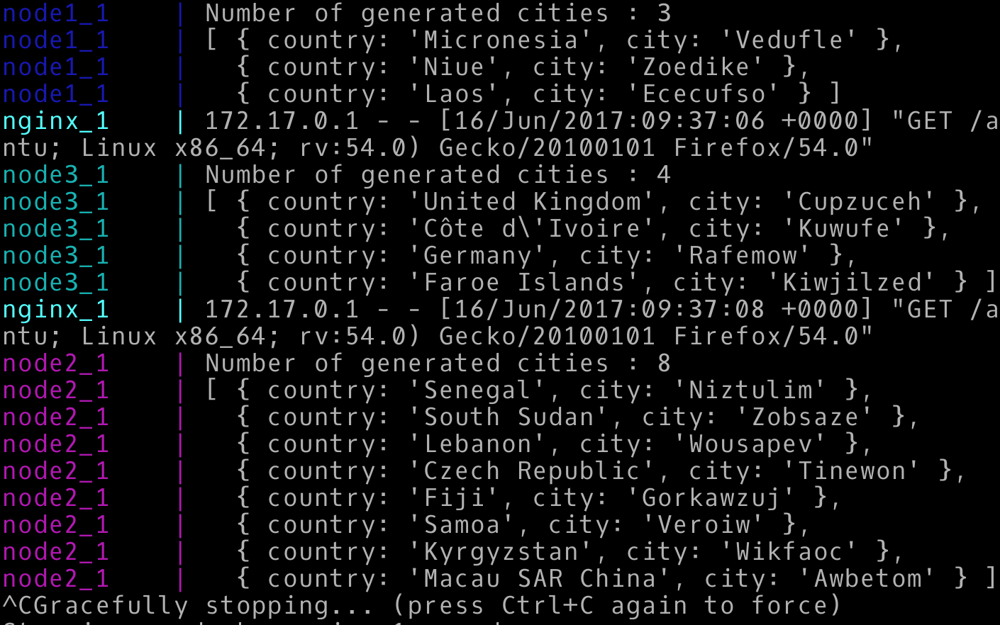
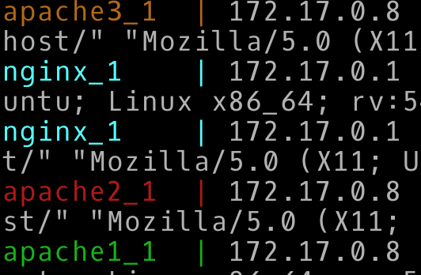

# Laboratoire HTTP Infrasctructure

### Première étape : Serveur apache httpd dockerisé servant du contenu statique

Pour la réalisation de cette étape, nous avons suivi le webcast fourni par le professeur sur le repo [Github](https://github.com/SoftEng-HEIGVD/Teaching-HEIGVD-RES-2017-Labo-HTTPInfra) du laboratoire. 

Nous avons tout d'abord trouvé une image docker d'un serveur apache servant du contenu statique sur le site de [dockerhub](https://hub.docker.com/) prête à l'emploi. Nous avons choisi, comme dans le webcast, l'image officielle de [php](https://hub.docker.com/_/php/). 

Le serveur `httpd apache` a été lancé dans un conteneur docker et la communication a été établie avec le navigateur web `Mozilla Firefox`.

La configuration du `Dockerfile` nécessaire pour la construction de l'image `docker` du serveur a utililsé le package `php:7.0-apache` de l'image officielle `php` invoquée ci-dessus. Il a été constaté très rapidement que le serveur `httpd apache` utililse les fichiers de configuration dans le conteneur depuis lequel il est lancé sous le répertoire `/var/www/html/`. C'est pour cette raison que la page `index.html` servie par ce dernier est copiée dans ce répertoire lors du `build` de l'image `docker` du serveur.

Un template gratuit a été téléchargé depuis [bootstrap](https://startbootstrap.com/template-categories/one-page/), retouché pour les besoins de ce laboratoire et a servi comme page de référence de cette partie. Ainsi, le code source de cette et ces ressources page ont été placés dans un dossier `content` lequel est copié dans `/var/www/html` comme expliqué précédemment. 

Commandes pour construire l'image et lancer le conteneur: 
* Build: `docker build -t res/apache_httpd .`
* Lancement du conteneur `docker run -d -p 1234:80 res/apache_httpd` 

### Deuxième étape : Application express.js dockérisée servant du contenu dynamique

Nous nous sommes appuiés sur le webcast fourni par le professeur afin de compléter cette partie. 

L'image `Docker` choisie pour cette section est celle de `node.js` trouvée sur [dockerhub](https://hub.docker.com/_/node/). Nous avons vu que la dernière version stable de `node.js` est la `6.10.3`, c'est pour cette raison que nous avons choisi cette dernière dans le `Dockerfile` de l'image `Docker` que nous avons construit.

L'application a été lancée dans un container `Docker` et les tests de communication ont été établis avec le navigateur `Mozilla Firefox`, `telnet` et `postman`.

A l'aide d'un `port-mapping` entre le port de l'application (3000) et celui utilisé dans le `deamon` `docker-machine`, nous avons facilement pu nous connecter au container depuis l'extérieur et voir qu'il fonctionnait bien.

L'application renvoie un tableau de longueur aléatoire contenant des noms de pays et cités aléatoires en réaction à la requête `GET` de la racine `/`.

Le module `chance.js` est utilisé pour la génération de contenu aléatoire. La longueur du tableau est aussi générée aléatoirement. Dans chaque entrée du tableau on a le nom d'un pays et le nom d'une ville aléatoires.

Commandes pour construire l'image et lancer le conteneur: 
* Build: `docker build -t res/express .`
* Lancement du conteneur `docker run -d -p 9090:3000 res/express` 

**Test sur localhost avec le navigateur**

**Test sur localhost avec telnet**

**Test sur le container docker avec le navigateur**

**Test sur le container docker avec telnet**

**Test sur le container docker avec postman**

### Troisième partie : Serveur apache httpd fonctionnant en reverse proxy

Dans cette partie, nous nous sommes aussi appuiés sur les webcasts fournis par le professeur.

Le but de cette partie est de lancer un serveur `apache httpd` en `reverse-proxy` dans un container `Docker`, un container wrappant le serveur de la première partie et un container wrappant l'application décrite dans la deuxième partie. Le `reverse-proxy` doit par la suite démultiplexer le trafic et le rediriger vers l'un ou l'autre des containers.

Ceci fait du `reverse-proxy` le seul point d'entrée à l'infrastructure du laboratoire, vu que les deux containers décrits précédemment ne sont pas accessibles depuis l'extérieur du `deamon Docker`. 

Le avantages de l'utilisation de ce type de structure ici est d'augmenter la sécurité de l'infrastructure derrière le `reverse-proxy` ainsi que de respecter le principe du [same origin policy](https://fr.wikipedia.org/wiki/Same-origin_policy). 

La configuration du `rp` a été effectuée dans le fichier `/etc/apache2/sites-available` dans un fichier nommé `001-reverse-proxy.conf`. Dans ce fichier, la configuration du `VirtualHost` a été effectuée afin de router seulement les requêtes `GET` ayant spécifié le `Host: lab.res.ch`. Deux types de contenu sont cependant servis. 

Pour les requêtes vers la racine `/`, renvoient le contenu statique du site web géré par le conteneur `Docker` de la première partie et pour celles vers le chemin `/api/cities/`, elles sont redirrigées vers l'application express de la deuxième partie qui renvoie du contenu dynamique.

Après avoir effectué les tests nécessaires de connectivité dans un container `php:7.0-apache`, le `Dockerfile` d'une nouvelle image a été configuré pour utiliser cette même image `php`. L'image va copier dans `/etc/apache2` le contenu d'un dossier de configuration établi au préalable, activer le mode `proxy` sur le serveur, et activer les nouveaux sites.

L'image ainsi construite et le container lancé avec un `port-mapping`, nous avons pu tester que le `reverse-proxy` fonctionnait bien avec un `telnet`mais pas avec le navigateur. Le problème est que dans ce dernier, il n'y a pas moyen de spécifier le nom d'hôte ce qui fait que le `rp` refuse l'accès. Pour palier à ceci, un nom de domaine a été rajouté dans le fichier `C:\Windows\System32\drivers\etc\Hosts` dans windows (`/etc/hosts` dans linux).

L'inconvénient de l'implémentation du `reverse-proxy` de cette manière est que les addresses ip dans les routes vers les conteneurs ont été mises en dur dans le fichier de config `001-reverse-proxy.conf`. Ceci n'est pas une bonne pratique car les conteneurs risquent de changer d'adresse lors d'un prochain démarrage et les routes seront alors perdues. Ceci convient cependant dans notre cas pour tester que le `rp` fonctionne et qu'il renvoie la bonne structure.

Commandes pour construire l'image et lancer le conteneur: 
* Build: `docker build -t res/rp .`
* Lancement du conteneur `docker run -d -p 9090:80 res/rp` 

**Test sur le container php:7.0-apache --> routage vers l'application express**

**Test sur le container php:7.0-apache --> routage vers la page html statique**

**Test sur le container php:7.0-apache --> accès refusé**

**Tests sur le nouveau container Docker**

**Configuration du fichier Hosts dans windows**

### Quatrième étape : Requêtes AJAX avec JQuery

Cette partie a été réalisée en s'appuiant sur les webcasts fournis par le professeur. 

Les modifications apprtées à la structure construite jusqu'ici sont les suivantes: 

* Modification des `Dockerfile`s des containers construits jusqu'ici pour qu'ils installent l'éditeur de texte `vim`.
* Rajout d'un script `javaScript` permettant de faire des requêtes `AJAX` depuis la page statique vers le container wrappant le serveur `express.js` dynamique. Ce script est respondable d'envoyer une requête au serveur, récupérer la réponse (un tableau de pays/villes) et afficher dans la page un message personnalisé extrait du premier élément du tableau. Dans le cas oû le tableau est vide, le script affiche un message par défaut.
* Rajout de l'importation du script ci-dussus dans le fichier `index.html` de la page statique.

Les tests ont été effectués depuis le conteneur wrappant le serveur `apache` statique. Le script `cities.js` a été rajouté sous `/var/www/html/js/`. Ce dernier défini la fonction responsable de lancer la requête `AJAX`, récupérer la réponse et afficher le message. 

Nous avons remarqué que les importations des librairies `js`, `AJAX`, `jQuery`, etc ainsi que les scripts nécessaires au bon fonctionnement de la page sont déclarés en toute fin du fichier `index.html`. C'est pour cette raison que le script `cities.js` a été rajouté dans cette section.

Les requêtes `AJAX` sont  ainsi envoyées depuis le navigateur web. Nous pouvons alors les visualiser directement dans le navigateur `Mozilla Firefox` sous `Outils/Développement Web/Outils de développement`. Sous l'onglet `réseau`, nous pouvons voir les requêtes effectuées par la page pour charger les scripts `js` et ensuite pour exécuter les requêtes `AJAX`.

### Cinquième étape : Configuration dynamique des adresses des conteneurs

Afin de compléter cette étape, nous avons suivi les webcasts fournis par le professeur.

Les modifications majeures apportées à l'infrastructure du laboratoire sont :

* Rajout d'un script `php` ayant pour but de récupérer les variables d'environnemt du conteneur et les écrire dans le fichier de configuration statique défini à l'étape 2.
* Rajout d'un script `bash` récupéré depuis l'image originale de `php:7.0-apache` permettant d'initialiser le serveur ainsi que de faire éventuellement quelques affichages lors du démarrage du conteneur. Ce script appelle le script `php` et redirige sa sortie dans le fichier de configuration désiré.
* Modification du `Dockerfile` de l'image statique pour qu'il puisse copier les deux scripts cités ci-dessus dans le `filesystem` du container.
* Lancement du conteneur du `reverse-proxy` en lui passant des variables d'environnement avec l'option `-e` de `docker`. Ces variables représentent en fait les adresses `IP` des conteneurs statique et dynamique. 

Des tests ont été effectué en lançant plusieurs conteneurs statiques et dynamiques, puis en récupérant une adresse de chacun des deux types. Ces addresses sont passées en paramètre au conteneur `reverse-proxy` qui lui, étant  le point d'entrée à l'infrastructure du laboratoire, est mappé sur un port de la `VM` de `docker`. La connexion avec le navigateur et l'inspection de la page te du trafic qui en découle semble être tout à fait cohérent.

Commandes pour construire l'image et lancer le conteneur: 
* Build: `docker build -t res/rp .`
* Lancement du conteneur `docker run -d -e STATIC_APP=172.17.0.4 -e DYNAMIC_APP 172.17.0.5 -p 1991:80 res/rp` 

### Etapes facultatives
#### Round Robin / load balancing
* Lancer la commande `docker-compose up` dans le dossier `docker-compose`. Le reverse proxy écoute sur le port 80.
* Pour supprimer les conteneurs : `docker-compose rm -f`

Nous avons poursuivi par l'étapes du load balancing. Nous utilisons pour ce faire le moteur Nginx qui est très connu pour faire du reverse proxy et est beaucoup plus simple d'utilisation. Il nous permettra aussi par la suite de faire des sticky session beaucoup plus facilement. Il suffit d'ajouter une configuration "proxy_pass" dans le language de scrypting Nginx en précisant, l'interface ip (sous forme de nom) sur laquelle nous souhaitons rediriger ainsi que son port. Il s'occupera ainsi de rediriger la requete. Une close de regrouppement nous permet en dehors de l'entete de redirection nous permet de mettre en commun toute nos address et d'y faire un round robin.
Nous utilisons ce principe pour les sites statiques en créant dans cette configuration `dockerCompose` 3 containters identiques aux étapes précédentes ainsi que les 3 containers nodes.

Nous utilisons également `docker-compose` qui nous permettra la création beaucoup plus aisée de toute les instances en une seule commande : `docker-compose up` qui lancera le script. Script qui pointe sur tout les autres fichiers `dockerfiles`.

Nous voyons sur l'image ci dessus que pour chaque requete javascript, un autre serveur répond à chaque fois. Il en est de même pour les serveurs apache. Cependant, comme c'est round robin, nous ne gardons pas toute les requetes sur le même serveur statique. Ainsi pour une même page web, nous aurons plusieurs serveur statique qui réponderons. Ce n'est pas la bonne manière de faire car ceci impacte les performances. Les requetes ne peuvent pas utiliser le propriétés http 2.0 tel que le pipelining etc qui accélèreraient et optimiserai beaucoup le processus.

Au point suivant : 
#### Sticky session (reverse proxy & load balancing)

Nous rajoutons simplement le parametre ip_hash; dans la stack de serveur apache dans la configuration `nginx.conf`. Cela nous permet de nous assurer que toute les personnes qui se connectent recoivent les informations du même serveur, et de ce fait, il y aura une seule connection tcp sur un seul serveur apache par client. Il pourra donc utiliser les mecanismes énoncés précédement comme le pipelining et autre.
Cette solution fonctionnera donc également si le client refuse les cookies (en mode privacy par exemple).

Une autre solution est d'utiliser le module sticky de nginx : https://bitbucket.org/nginx-goodies/nginx-sticky-module-ng/overview Instanciation d'un cookies à durée limitée. Mais il est préférable d'utiliser ces cookies de session du côté des serveurs backend ce qui permettra de différencier les clients entre eux.
Le parametre a rajouter dans la stack de serveurs apache est `sticky cookie srv_id expires=1h domain=.example.com path=/;` uniquement.

